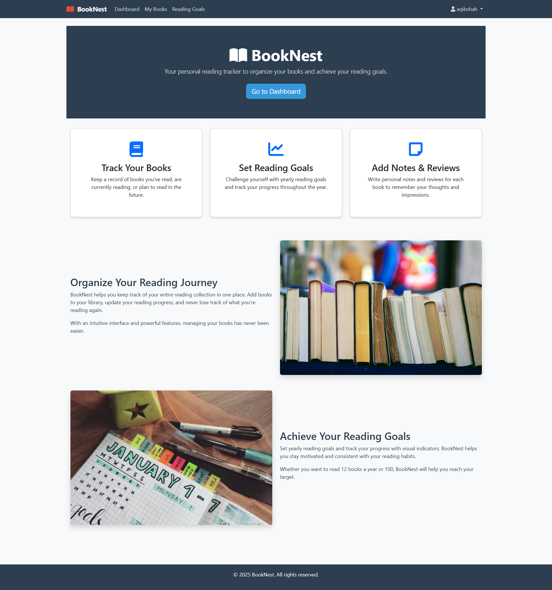

# 📚 BookNest

**BookNest** is your personal reading tracker to organize books and set yearly reading goals. Whether you're an avid reader or just trying to read more regularly, BookNest helps you manage your book collection, track reading progress, and stay motivated.



---

## 🚀 Features

- **Track Your Books**: Add books you've read, are currently reading, or plan to read in the future.
- **Set Reading Goals**: Define yearly reading goals and track progress visually.
- **Notes & Reviews**: Write personal notes and reviews for each book to retain insights and impressions.
- **Organized Dashboard**: Overview of reading goals and recently added books.
- **Progress Visualization**: Clear indicators for goal tracking and reading completion.

---

## ⚙️ Tech Stack

- **Backend**: Django (Python)
- **Frontend**: HTML, Bootstrap, Crispy Forms
- **Database**: PostgreSQL
- **Authentication**: Django built-in user system
- **Templating**: Django Templates

---

## 🛠️ Setup Instructions

1. **Clone the repository**

```bash
git clone https://github.com/aqibcs/BookNest.git
cd BookNest
````

2. **Create virtual environment**

```bash
python -m venv env
source env/bin/activate  # or env\Scripts\activate on Windows
```

3. **Install dependencies**

```bash
pip install -r requirements.txt
```

4. **Run migrations**

```bash
python manage.py migrate
```

5. **Run the development server**

```bash
python manage.py runserver
```

6. **Access the app**
   Open your browser and go to: `http://127.0.0.1:8000/`

---

## 🙋‍♂️ Author

* **Aqib Shah** – [@aqibshah](https://github.com/aqibcs)
